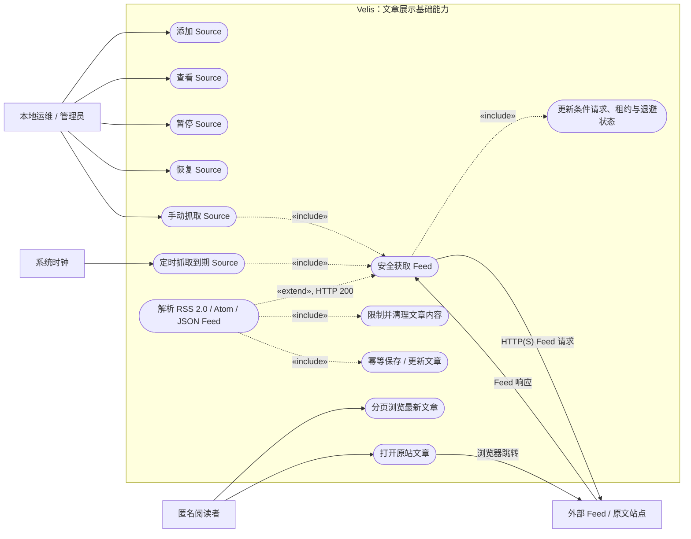
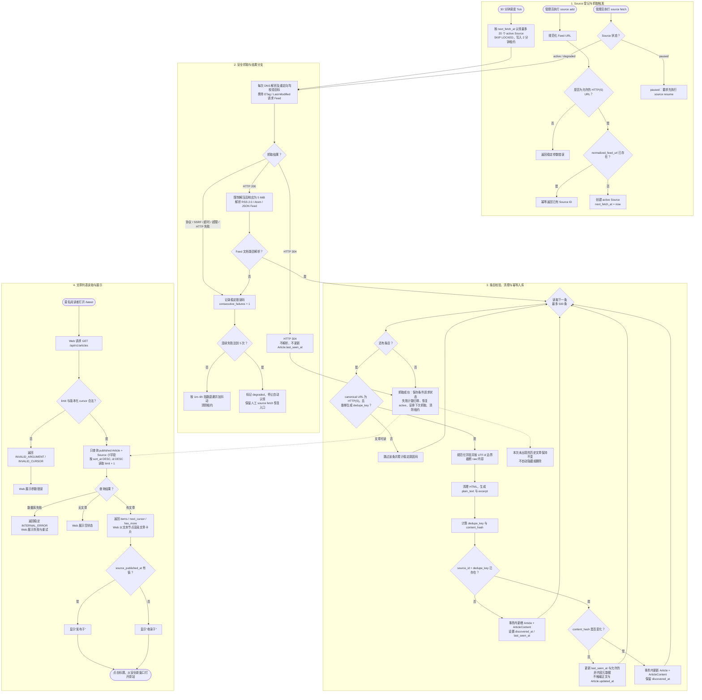
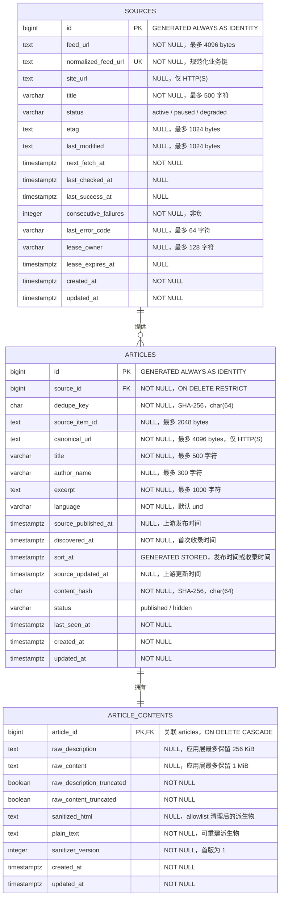
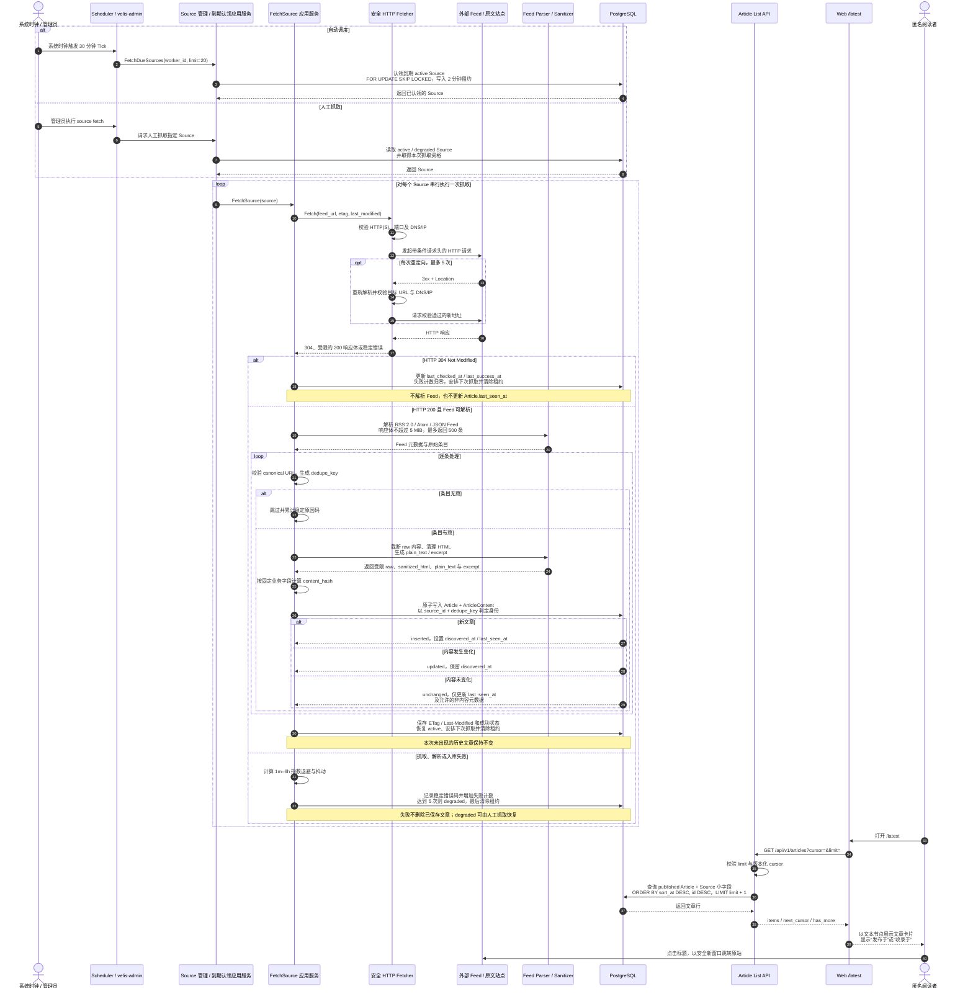
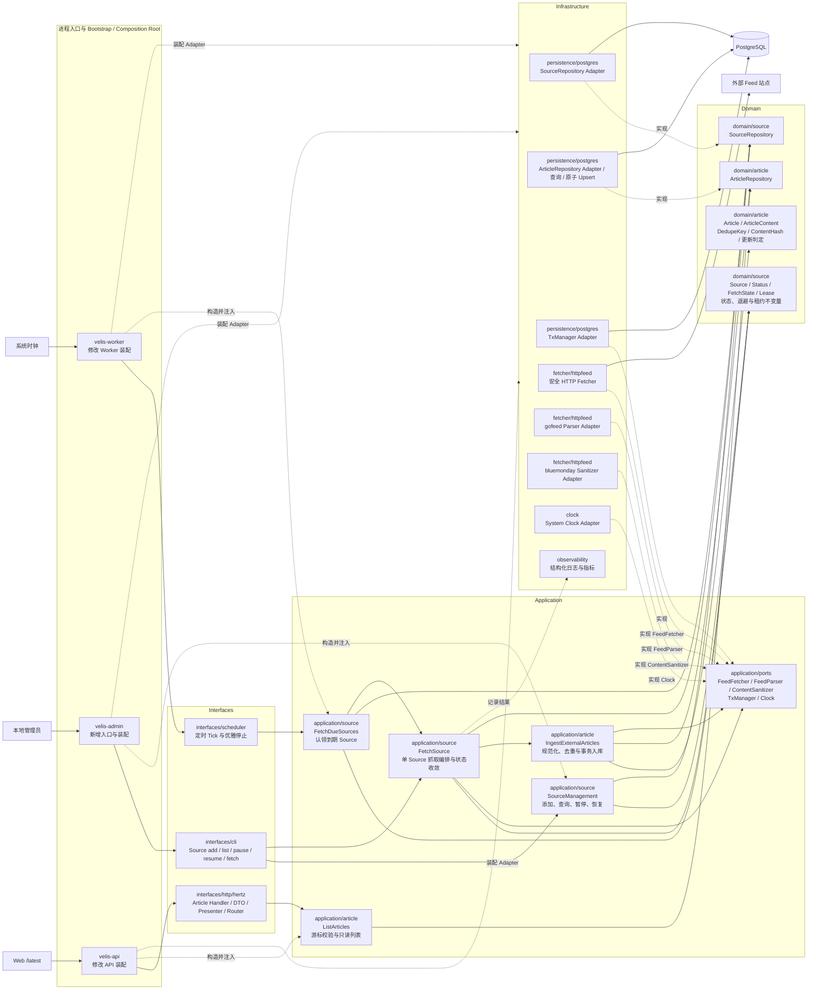

# 设计图 — 文章展示基础能力

> 本文用于可视化 `spec.md` 已确认的业务契约。若图与文字规格出现冲突，以 `spec.md` 为准，并在进入 Apply 前修正图示。

## 图示进度

| 图示 | 状态 | 确认结果 |
|---|---|---|
| 1. 用例图 | 已完成 | 开发者已确认 |
| 2. 业务流程图 | 已完成 | 开发者已确认 |
| 3. ER 图 | 已完成 | 开发者已确认 |
| 4. 流程时序图 | 已完成 | 开发者已确认 |
| 5. 后端四层实现架构图 | 已完成 | 开发者已确认 |

## 1. 用例图

### 边界说明

- “本地运维 / 管理员”通过 `velis-admin source add/list/pause/resume/fetch` 管理系统级 Source；本次不提供 Source HTTP 写接口。
- “系统时钟”只表示定时触发者，调度和 Worker 仍属于 Velis 内部能力。
- “匿名阅读者”只能浏览文章列表并跳转原站；本次没有账号、订阅、站内文章详情、互动或推荐用例。
- “外部 Feed / 原文站点”位于系统边界外。Velis 仅接受 HTTP(S)，抓取需执行 SSRF、重定向、超时和响应大小限制。
- Feed 返回 HTTP 200 时才扩展执行解析和入库；HTTP 304 只更新抓取状态，不解析文章。
- 用例图表达参与者与系统职责，不表达实际执行先后；抓取分支、失败处理和事务顺序将在业务流程图与流程时序图中展开。

## 2. 业务流程图

### 流程约束说明

- Source 重复添加是幂等成功，不创建重复记录；新 Source 立即进入可抓取状态。
- 自动抓取仅认领 `active` 且到期的 Source；`paused` 不参与调度，`degraded` 只能通过人工抓取成功后恢复。
- HTTP 304 视为一次成功检查，但不解析 Feed，也不更新任何 Article 的 `last_seen_at`。
- 单条无效文章只被跳过，不回滚同批其他合法条目；完整 Feed 无法解析则按抓取失败处理，旧文章保持可用。
- `content_hash` 未变化时只更新仍出现文章的 `last_seen_at`；Feed 中消失的历史文章不自动删除或隐藏。
- 文章列表不读取 `article_contents` 大字段；分页游标由 `(sort_at, id)` 构成，Web 不自行重排。

## 3. ER 图

### 关系与约束说明

- 一个 `source` 可以暂时没有文章，也可以拥有多篇文章；每篇 `article` 必须且只能属于一个 `source`。
- 每篇 `article` 在业务上必须且只能有一条 `article_content`。Article 与 ArticleContent 在同一事务中写入，正文分表使列表查询无需搬运大字段。
- `articles.source_id` 使用 `ON DELETE RESTRICT`：Source 的日常“删除”意图只映射为 `paused`，不能级联删除历史文章。
- `article_contents.article_id` 使用 `ON DELETE CASCADE`，仅服务于未来独立且受控的 Article 物理清理操作；本 change 不提供该操作。
- `articles` 的业务唯一键是组合约束 `UNIQUE(source_id, dedupe_key)`；图中的 `dedupe_key` 不能被理解为全局唯一。
- `sort_at` 是数据库存储生成列：`COALESCE(source_published_at, discovered_at)`，确保发布时间缺失时仍能稳定分页。

### 核心索引与 CHECK

| 表 | 约束或索引 | 用途 |
|---|---|---|
| `velis.sources` | `UNIQUE(normalized_feed_url)` | Source 重复添加时幂等返回已有记录。 |
| `velis.sources` | `(next_fetch_at, id) WHERE status = 'active'` | Worker 按到期时间认领 Source。 |
| `velis.sources` | status、非负失败计数、租约字段成对为空/非空 CHECK | 保护 Source 状态与租约不变量。 |
| `velis.articles` | `UNIQUE(source_id, dedupe_key)` | 并发抓取下的最终去重防线。 |
| `velis.articles` | `(sort_at DESC, id DESC) WHERE status = 'published'` | 最新文章 keyset 分页。 |
| `velis.articles` | `(source_id, last_seen_at DESC)` | 按来源排查最近一次出现时间。 |
| `velis.articles` | status CHECK | 首版只允许 `published / hidden`。 |

### 明确不建的关系

- 本阶段没有用户与订阅关系，因此不创建 `users`、`subscriptions` 或 `source_user_relations`。
- 不创建 `source_fetch_logs`；`sources` 只保存当前抓取状态，历史诊断依赖结构化日志。
- 不创建标签、统计、搜索、Embedding、Revision 或互动相关表。

## 4. 流程时序图

### 时序职责说明

- `Scheduler / velis-admin` 只负责协议适配和触发 Application；到期认领、指定 Source 读取和抓取资格判定由 Source Application Service 负责，Interfaces 不直接访问 PostgreSQL。
- `FetchDueSources` 将已认领 Source 逐个交给 `FetchSource`；抓取编排、成功/失败判定由 `FetchSource` 应用服务负责。
- Fetcher 是唯一可以访问 Feed 网络地址的组件，并在初始请求及每次重定向前重新执行 URL、DNS 和目标 IP 校验；Parser 不联网。
- Parser/Sanitizer 负责格式解析和内容派生，不直接写数据库；Article 与 ArticleContent 的一致写入由 PostgreSQL Repository 事务保证。
- 数据库唯一约束是并发去重的最终防线。重复执行同一 Source 抓取应得到相同 Article 身份，并安全收敛到 inserted、updated 或 unchanged。
- 列表 API 只读取 Article 与 Source 小字段，不读取 ArticleContent；Web 使用服务端顺序和游标，不在客户端重新排序。
- 图中省略了日志与指标调用；它们只能记录 Source ID、稳定结果码、耗时和计数，不记录 Feed 正文或完整 URL query。

## 5. 后端四层实现架构图

### 图例与依赖约束

- 实线箭头表示运行时调用；“实现”虚线表示 Infrastructure Adapter 实现内层声明的抽象；“构造并注入”虚线只表示 Bootstrap 装配，不代表业务层反向依赖。
- Interfaces 只能调用 Application，不直接访问 PostgreSQL、Fetcher 或第三方库。Application 组织用例与事务，并依赖 Domain 和抽象端口；Infrastructure 依赖内层契约并提供实现。
- Repository 抽象随聚合放在 `domain/source`、`domain/article`；Fetcher、Parser、Sanitizer、事务和时钟属于技术能力，抽象放在 `application/ports`。
- `application/source` 可以调用 `application/article` 的入库用例完成跨模块编排；Article Domain 不依赖 Source Application，只通过 `source_id` 保持归属关系。
- Bootstrap 是 Composition Root，不是第五个业务层；它可以同时依赖四层，但只负责构造、注入、进程生命周期和优雅关闭。

### 分层改动清单

| 层/配套范围 | 包 | 主要组件或接口 | 职责 | 变更类型 |
|---|---|---|---|---|
| Domain | `internal/domain/source` | `Source`、`Status`、`FetchState`、`Lease`、`SourceRepository` | 维护 Source 身份、状态切换、租约、成功/失败收敛、退避和下次抓取时间等不变量；声明 Source 持久化抽象 | 在占位包中新增业务实现，并更新包说明 |
| Domain | `internal/domain/article` | `Article`、`ArticleContent`、`DedupeKey`、`ContentHash`、更新判定、`ArticleRepository` | 维护外部文章稳定身份、内容版本判定、首次收录与最近出现语义；声明 Article/Content 一致持久化和列表读取抽象 | 在占位包中新增业务实现，并更新包说明 |
| Application | `internal/application/source` | `SourceManagement`、`FetchDueSources`、`FetchSource` Command/Result/View | 编排 Source 添加、查询、暂停、恢复、认领和单次抓取；调用抓取/解析端口与 Article 入库用例；统一更新成功、304、失败和 degraded 状态 | 在占位包中新增用例实现 |
| Application | `internal/application/article` | `IngestExternalArticles`、`ListArticles`、游标模型、Article Card View | 将标准化条目转换为领域输入，计算稳定身份与内容变化，控制 Article/Content 事务；提供不读取正文的稳定分页查询 | 在占位包中新增命令、查询和只读模型 |
| Application | `internal/application/ports` | `FeedFetcher`、`FeedParser`、`ContentSanitizer`、`TxManager`、`Clock` | 隔离网络、第三方 Feed/HTML 库、事务与系统时间；端口输入输出只使用项目自有类型 | 修改现有 ports 范围，新增技术端口 |
| Infrastructure | `internal/infrastructure/persistence/postgres` | Source Repository Adapter、Article Repository Adapter、列表 Query、原子 Upsert、TxManager Adapter | 使用显式 `velis.` schema 实现唯一约束、租约认领、Article/Content 原子写入和 keyset 查询；把 pgx 类型限制在 Infrastructure | 扩展现有 PostgreSQL 包；保留现有连接池能力 |
| Infrastructure | `internal/infrastructure/fetcher/httpfeed` | Safe HTTP Fetcher、gofeed Parser Adapter、bluemonday Sanitizer Adapter | 实现条件请求、SSRF/DNS/重定向/超时/大小限制，解析三种 Feed，并生成受限 raw、sanitized HTML 与纯文本 | 在占位包中新增 Adapter 实现 |
| Infrastructure | `internal/infrastructure/clock` | System Clock Adapter | 为调度、租约、退避和测试提供可替换时间源 | 在占位包中新增 Adapter 实现 |
| Infrastructure | `internal/infrastructure/observability` | Fetch/Ingest 结构化日志与指标记录 | 记录稳定结果码、耗时和计数；禁止正文和完整 URL query 进入日志或指标标签 | 修改现有观测能力 |
| Interfaces | `internal/interfaces/cli` | Source Commands 与输入/输出映射 | 解析 `source add/list/pause/resume/fetch` 参数、调用 Application、映射退出码；不承载业务规则或数据库访问 | 在占位包中新增 CLI Adapter |
| Interfaces | `internal/interfaces/scheduler` | Tick Runner、取消与优雅停止 | 按周期触发 `FetchDueSources`，传递 Worker 身份和取消信号；不直接认领数据库记录 | 在占位包中新增 Scheduler Adapter |
| Interfaces | `internal/interfaces/http/hertz` | Article Handler、DTO、Presenter、Router | 绑定并校验 `cursor/limit`、调用 `ListArticles`、输出统一 JSON 信封和稳定错误码 | 修改现有 Hertz HTTP 包 |
| Composition Root | `internal/bootstrap` | API、Worker、Admin 装配 | 创建 Repository 和技术 Adapter，注入 Application 与 Interfaces，管理连接池和进程生命周期 | 修改 API/Worker 装配，新增 Admin 装配能力 |
| 进程入口 | `backend/cmd` | `velis-admin` | 加载现有配置与日志，启动受控本地管理 CLI | 新增进程入口；现有 API/Worker 入口按装配需要做最小修改 |
| 数据与契约 | `backend/migrations`、`backend/api/openapi`、配置 | Source/Article/Content migration、Article List OpenAPI、抓取/调度配置 | 建立可回滚 schema、公开只读列表契约，并提供安全抓取和调度参数 | 新增 migration，修改 OpenAPI 与配置 |
| Web | `web/src` | Article API Client、类型、`features/article`、`/latest` View | 请求文章列表、展示文本卡片和安全原站链接；不进入后端四层 | 修改现有占位页面并新增文章展示能力 |

### 明确不修改的模块

- `domain/application` 下的 account、feed、interaction、relation、exposure、recommendation、embedding 不参与本次闭环；不为未来能力预建跨模块抽象。
- Redis、RabbitMQ/Outbox、MinIO、pgvector、Eino 适配器不接入本次运行链路；Worker 直接调用 Application Service。
- 本次不新增 Source HTTP 写接口、Article 详情接口、用户鉴权、订阅关系、互动、推荐、搜索或站内正文渲染。
- 上表锁定包、主要组件/接口、职责和变更类型；具体 `.go` 文件、结构体字段、函数签名与文件级实施顺序留到 `tasks.md` 细化和 Apply 阶段决定。
